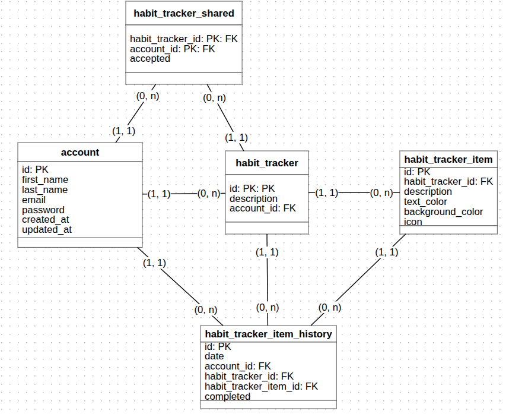

# gemu-habit-tracker

**Gemu Habit Tracker** é um sistema de controle de hábitos, com intrface rica, limpa e responsiva.

> 💡 Desenvolvido para auxiliar no controle dos hábitos, de maneira divertida e simples. Direto ao ponto!

## 🚀 Funcionalidades

---

## 🛠️ Tecnologias

---

## 📁 Estrutura de Pastas

---

## 🗄️ Banco de Dados

---

## ▶️ Como rodar o projeto

---

## 🧑🏻‍💻 Autor

Feito com 💙 por [Murillo IDM](https://github.com/MurilloIDM)

---

## ⚖️ Licença

Distribuído sob a licença MIT. Veja [`LICENSE`](LICENSE) para mais informações.
